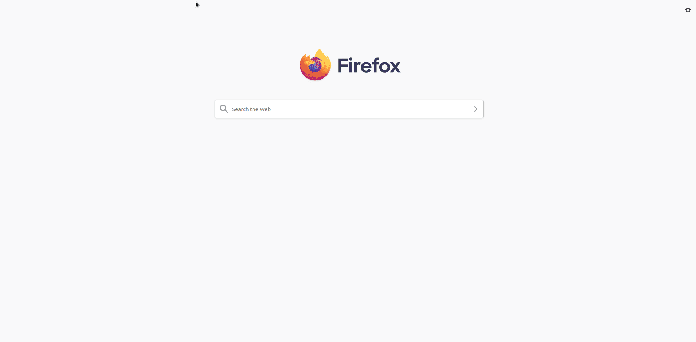

# What if I had invested in Vanguards??

**Disclaimer: All computations are based on previous historic numbers so it is not a guarantee that if you invested now you'd get the same returns. You can't predict the future!**

Lets say you have some money, how much could you benefit if you put that into a Vanguards account instead of your bank's standard savings account years ago? My bank only offers 0.05% + tiny bonuses annually and high interest savings accounts like Ally, EQ Bank are around 2% - 3%

This is just a site inspired by my own personal experience of learning about investing.

I built and designed this as a one page responsive bootstrap website.

# Demo
Gif is a bit choppy due to recording software. Much smoother in person.

# How does it work?

Actual information based on Canadian Couch Potato's research [here](https://cdn.canadiancouchpotato.com/wp-content/uploads/2020/01/CCP-Model-Portfolios-Vanguard-ETFs-2019.pdf) so credits to them. This website takes in what free cash you have and
then computes the potential value of the stock portfolio if you invested in the Vanguard Conservative Income ETF Portfolio based on the average rate of return.

# Technology stack

Frontend
* [Bootstrap 4.0](https://getbootstrap.com/)
* [mdBootstrap](https://mdbootstrap.com/) for some animations
* Vanilla JavaScript for some basic DOM manipulation
* CSS
* HTML

Backend
* Django
* Python

# How to run
In the main directory:
`pythom manage.py runserver`

# Bugs

* For some reason the landing page's image does not show up on Chrome

# TODO

* Need to work on re-sizing for smaller screens

* The html code was hastily put together so there are some parts of it that could be cleaned

* Move the JS code into a separate folder

* Implement django forms for user input, right now it it is just sending a post request without input validation

* dockerize the application for quick deployment
